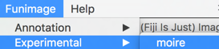
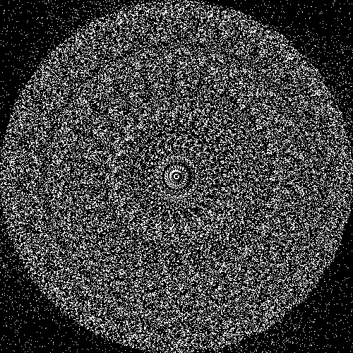
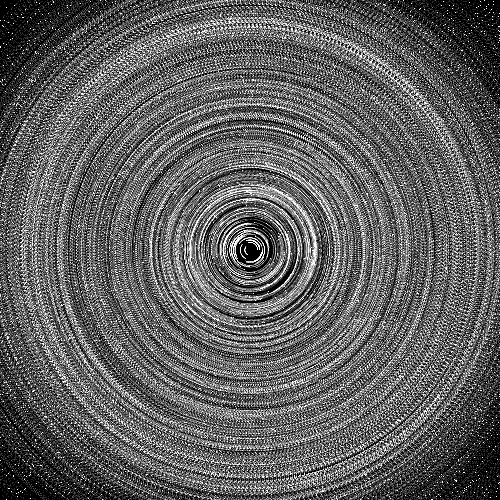

Example of Moiré effect. Each frame is a step of rotation.

The Moiré effect on random dots was developed to illustrate the effect of local correlations on visual perception by Leon Glass (Glass, 1969). Glass first demonstrated the effect using a copy machine and copying a piece of paper with random noise. Local linear patterns are observed for small rotations. As the rotation is increased the perceived linear correlation is broken. The algorithm is simple and can be tested using the following demo:

First, install Fiji (<a href="http://imagej.net/Fiji/Downloads" target="_blank">download here</a>) for your platform

Second, enable the <a href="https://github.com/funimage/funimage" target="_blank">Funimage</a> update site (<a href="http://imagej.net/List_of_update_sites">instructions here</a>)

Third, run the Moiré effect plugin:

Enjoy, and if you want to modify the Clojure code <a href="https://github.com/funimage/funimage/blob/master/src/plugins/Scripts/Funimage/Experimental/moire_.clj" target="_blank">it is available in the Funimage repository</a>.

There are many amusing variants of this algorithm that are not designed to explain neural mechanisms, yet produce interesting patterns:

(Left) Iteratively take the conjunction of the previous image and its rotation
(Right) Take the sum of all frames in a Moiré pattern

Reference:
<em>Glass, L., 1969. </em><strong>Moiré effect from random dots</strong><em>. Nature, 223(5206), pp.578-580.
Gabrielyan, E., 2007. </em><strong>Examples of random moiré. </strong><em>https://docs.switzernet.com/people/emin-gabrielyan/070212-random-moire/ (Accessed 01/01/2017).
</em>