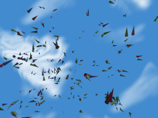

Swarming and flocking is a fascinating emergent behavior. Agents that follow simple rules, such as stay close to your neighbor (but not too close), can lead to emergent phenomena when many agents are combined together.

Here you can see a simple 3D swarm simulation implemented in Clojure with the <a href="http://brevis.us" target="_blank">Brevis</a> library. With just over 100 lines of code we can have a 3D swarm.

The full repository is available: <a href="https://github.com/brevis-us/brevis-simple-swarm" target="_blank">https://github.com/brevis-us/brevis-simple-swarm</a>

The simplest way to get started is:
<ol>
	<li>Use Git to checkout the repository</li>
	<li>Use Leiningen (http://leiningen.org/) to run the simulation with the command:
<ul>
	<li>lein run -m brevis-simple-swarm.core</li>
</ul>
</li>
	<li>The swarm should then start running.</li>
</ol>
&nbsp;

Note that this example does not implement the complete flocking dynamics as initially proposed by Craig Reynolds (Reynolds, 1987). That is left as an exercise for the reader/students/etc..

(Reynolds, 1987): <a href="https://scholar.google.com/scholar?oi=bibs&amp;cluster=16816699856673150878&amp;btnI=1&amp;hl=en">Flocks, herds and schools: A distributed behavioral model</a>, CW Reynolds - ACM Siggraph Computer Graphics, 1987]]>